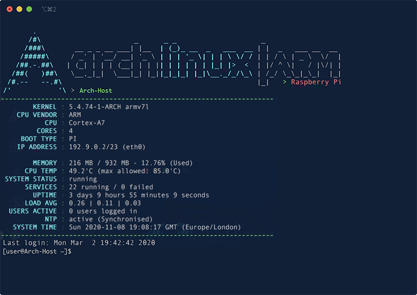

# Arch Linux MOTD



## Features
Pretty self explanatory. It works for Arch linux on:
-  x86_64 machines (Intel/AMD based)
-  ARM based machines (Raspberry Pi) 

It will auto detect which architecture your system is and work accordingly.

Currently it can only display temperatures for Raspberry Pi, but using the `lm_sensors` package this could be done.

## Usage
The MOTD is usually displayed when a user logs into the system (via KB and mouse or ssh or other means). The Linux PAM config specifies the when to display the MOTD. 

The `generate_motd.sh` script executes on user login to output to the motd. Then at the "display motd" step of user login the new generated output is displayed. - _This is what makes the motd dynamic._

Once installed, log in to your system and the script will update your `/etc/motd` with system data.

This happens before the user is given a prompt and after successful login.

## Setup

**Please Note: Editing the PAM configuration can be dangerous and will break your system if done incorrectly. It is recommended to back up before making changes otherwise you may not be able to log into your system again.**

1. Install the `generate_motd.sh` in `/bin/` directory
2. Give the script the same permissions as any other app in `/bin` (run as root or sudo): `chmod 0755 /bin/generate_motd.sh`
3. Make sure the script has the correct ownership: `chown root:root /bin/generate_motd.sh`
4. Update the `system-login` pam config file to execute the script before displaying the `motd`
  
### Updating the pam file:
The below changes will affect all logins (local, ssh etc.) If you wish to do just ssh, then do something different. **Please understand what changes your are making and their impact before you do it**

In the file: `/etc/pam.d/system-login` add the new line.

Go from this:
```
session    include    system-auth
session    optional   pam_motd.so          motd=/etc/motd
```
To this:
```
session    include    system-auth
session    optional   pam_exec.so          /bin/generate_motd.sh
session    optional   pam_motd.so          motd=/etc/motd
```

**Please Note: Check these settings against the Linux PAM manual and be aware of changes you are making mean for your system.**

Information about linux PAM can be found here:
- [https://dzone.com/articles/linux-pam-easy-guide](https://dzone.com/articles/linux-pam-easy-guide)
- [https://linux.die.net/man/8/pam](https://linux.die.net/man/8/pam)
- [https://linux.die.net/man/5/pam.d](https://linux.die.net/man/5/pam.d)
- [https://wiki.archlinux.org/index.php/PAM](https://wiki.archlinux.org/index.php/PAM)

## Future Work
- Temperature for x86_64 (Intel/AMD) based machines
- Partition usage (similar to memory usage) that's dynamically detected
- Swap usage (similar to memory usage)

## Reference
This motd generator for Arch Linux has been adapted from github user **lfelipe1501**'s motd generator. 
This is the original code that I have adapted my version from: [https://github.com/lfelipe1501/Arch-MOTD](https://github.com/lfelipe1501/Arch-MOTD)
